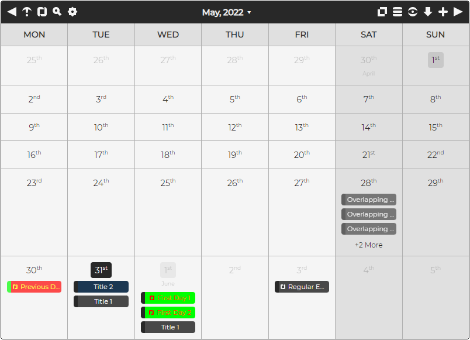
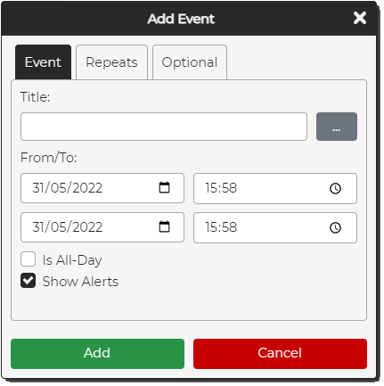
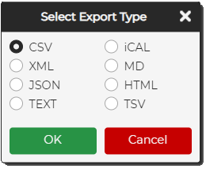
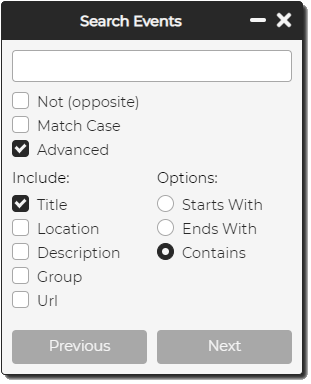

## Welcome to Calendar v1.4.1!

This page is under construction, so please be patient! The development of Calendar.js is ongoing and new versions are being pushed regularly, so keep checking back!



Calendar.js includes the following features:

Features include:
- Adding, updating, and removing events, with full custom colors support.
- Full API available via public functions.
- Drag and Drop for events.
- Copy & Paste, and Duplication of events.
- Configurable text for translations.
- Day, Week, Month, and All Events views.
- Fully styled in CSS/SASS (including the buttons).
- Custom events for actions (adding/updating/removing events, skipping months, etc).
- Export to CSV, XML, JSON, TEXT, iCAL, MD, HTML, and TSV.
- Full-screen mode (double clicking the title bar).
- Search support.
- Repeat every Day, Week, Month, Year, or a custom period (with exclusion days support).
- Customizable holidays.
- Navigation keys (in full-screen mode):
  1. Left:  Moves to the previous month.
  2. Right:  Moves to the next month.
  3. Escape:  Close the active dialog, or full-screen mode.
  4. Down:  Jumps to the current month.
  5. F5:  Refreshes the current view.
  6. Ctrl/Command + Left:  Moves to the previous year.
  7. Ctrl/Command + Right:  Moves to the next year.
- Navigation keys (global):
  1. Escape:  Closes the active dialog.
  2. Ctrl/Command + Shift + A:  Opens the Add Event dialog (if manual editing is enabled).
  3. Ctrl/Command + Shift + F:  Opens the search dialog.
- Custom event groups (with configurable toggles).
- Browser notifications for events (modern browsers only).
- Drop file support (allowing a file containing JSON, or an array of events, to be added).
- DatePicker mode (just assign to the ID of an text input).
<br />

## Recent Changes:

To see all the latest changes, click [here](changes.md).
<br>
<br>

## Options:

To see all the available options, click [here](options.md).
<br>
<br>

## Search Options:

To see all the available search options, click [here](search_options.md).
<br>
<br>

## Event Object Format:

To see how an event object should be formatted, click [here](event.md).
<br>
<br>

## Holiday Object Format:

To see how an holiday object should be formatted, click [here](holiday.md).
<br>
<br>

## Public Functions:

To see all the available public functions, click [here](functions.md).
<br>
<br>

## Getting Started

You will need to include the JavaScript file and CSS Style Sheet in the head of your HTML:

```markdown
<link rel="stylesheet" href="src/calendarjs.css" />
<script src="src/calendarjs.js"></script>
```

You will also need to set the page character encoding to UTF-8. This can be included in the head of your HTML as follows:

```markdown
<meta charset="utf-8" />
```
<br>

## Creating a container DIV

Add a div into your HTML and assign it an ID, as follows:

```markdown
<div id="calendar"></div>
```
<br>

## Initialising Calendar.Js:

It's now time to initialize Calendar.js, which is done as follows:

```markdown
<script> 
  var instance = calendarJs("calendar"); 
</script>
```

After this, the calendar will be rendered and you will have access to the public methods available.
<br>
<br>

## Adding A New Event:

To add a new event, click the "+" button on the toolbar.  You will be shown the following dialog:



Fill in the details and click "Add".  You have to specify a title and from date.  Everything else is optional.
<br>
<br>

## Exporting Events:

To export the events in the current view, click the down arrow button on the toolbar.  You will be shown the following dialog:



Select the export type you desire and press "OK".
<br>
<br>

## Search For Events:

To search for events, click the search button on the toolbar.  You will be shown the following dialog:



Enter the search criteria and select your required options.  Press "Next" to start the search.  You can move back and forth between the search results.

Note:  Changing your search criteria will reset the current search.
<br>
<br>

## Finishing Up:

That's it! Nice and simple. Please refer to the code if you need more help (fully documented).

Minimized versions of the files are available.